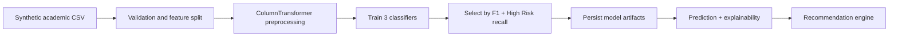

# SmartEdu AI

Explainable Student Performance Prediction and Personalized Academic Guidance Recommendation System.

SmartEdu AI is an academic support project that predicts student risk levels, explains likely risk factors, and generates personalized study recommendations. Phase 1 focuses on a clean Python ML foundation: synthetic data generation, preprocessing, model training, evaluation, prediction, explainability fallback logic, and recommendation rules.

> SmartEdu AI is an academic support tool. Predictions are probabilistic and should be used by mentors and educators as guidance, not as a final decision about a student.

## Phase 1 Features

- Generates 300 realistic synthetic student records.
- Creates logical risk labels: `Low Risk`, `Medium Risk`, `High Risk`.
- Trains Logistic Regression, Random Forest, and Gradient Boosting models.
- Selects the best model using macro F1-score and High Risk recall.
- Saves trained artifacts in `ml/model_registry/`.
- Supports single-student prediction with confidence, top factors, explanation, and recommendations.
- Includes SHAP-aware explainability with a robust fallback when SHAP is unavailable.
- Includes pytest coverage for preprocessing, prediction, and recommendations.

## Project Structure

```text
SmartEdu Ai/
├── README.md
├── requirements.txt
├── .env.example
├── data/
│   ├── generate_sample_data.py
│   ├── sample_students.csv
│   ├── raw/
│   │   └── .gitkeep
│   └── processed/
│       └── .gitkeep
├── ml/
│   ├── __init__.py
│   ├── preprocessing.py
│   ├── train_model.py
│   ├── evaluate_model.py
│   ├── predict.py
│   ├── recommendation_engine.py
│   ├── explainability.py
│   └── model_registry/
│       ├── .gitkeep
│       ├── model.joblib
│       ├── preprocessor.joblib
│       ├── metrics.json
│       └── feature_names.json
└── tests/
    ├── test_preprocessing.py
    ├── test_prediction.py
    └── test_recommendations.py
```

## Setup

```bash
python -m venv .venv
.venv\Scripts\activate
pip install -r requirements.txt
```

On macOS/Linux:

```bash
python -m venv .venv
source .venv/bin/activate
pip install -r requirements.txt
```

## Run Commands

Generate the dataset:

```bash
python data/generate_sample_data.py
```

Train models and save the best artifacts:

```bash
python ml/train_model.py
```

Evaluate the saved model:

```bash
python ml/evaluate_model.py
```

Run tests:

```bash
pytest
```

## Dataset Schema

| Column | Meaning |
| --- | --- |
| `student_id` | Unique student identifier. |
| `name` | Synthetic student name. |
| `department` | Academic department. |
| `year` | Current year of study. |
| `semester` | Current semester. |
| `gender` | Synthetic gender category. |
| `attendance_percentage` | Overall attendance percentage. |
| `internal_marks_average` | Average internal assessment marks. |
| `assignment_completion_rate` | Assignment completion percentage. |
| `quiz_average` | Average quiz score. |
| `previous_semester_gpa` | Previous semester GPA on a 10-point scale. |
| `current_gpa` | Current GPA on a 10-point scale. |
| `study_hours_per_week` | Weekly study hours outside class. |
| `backlogs` | Number of unresolved backlogs. |
| `late_submissions` | Count of late submissions. |
| `participation_score` | Class participation score. |
| `subject_math_score` | Mathematics score. |
| `subject_programming_score` | Programming score. |
| `subject_electronics_score` | Electronics score. |
| `subject_communication_score` | Communication score. |
| `subject_lab_score` | Lab performance score. |
| `library_usage_hours` | Weekly library usage. |
| `lms_login_frequency` | LMS logins per week. |
| `parent_meeting_count` | Parent meetings in the term. |
| `mentor_meeting_count` | Mentor meetings in the term. |
| `extracurricular_hours` | Weekly extracurricular hours. |
| `stress_level` | Self-reported stress level from 1 to 10. |
| `sleep_hours` | Average sleep hours per night. |
| `internet_access` | Whether reliable internet access is available. |
| `risk_label` | Target label: Low Risk, Medium Risk, or High Risk. |

## ML Architecture



## Model Artifacts

Training saves:

- `ml/model_registry/model.joblib`
- `ml/model_registry/preprocessor.joblib`
- `ml/model_registry/metrics.json`
- `ml/model_registry/feature_names.json`

## Future Phases

- FastAPI backend with `/predict`, `/students`, `/analytics`, and `/recommendations`.
- Database schema using SQLAlchemy.
- Streamlit dashboard for mentors and students.
- CSV upload and batch prediction workflow.
- Optional GenAI mentor chatbot.
- Docker and GitHub Actions CI.

## Resume Bullets

- Built an explainable ML pipeline for early student academic risk detection using Scikit-learn, model comparison, and persisted inference artifacts.
- Engineered realistic synthetic education data with rule-based target labeling to reflect attendance, GPA, assignments, backlogs, stress, and sleep patterns.
- Implemented personalized academic recommendation logic with test coverage for preprocessing, inference, and guidance generation.

## Interview Pitch

SmartEdu AI is an academic support system that identifies students who may need help before problems become severe. In Phase 1, I built the ML foundation: a realistic synthetic dataset, preprocessing pipeline, three model candidates, model selection based on F1 and High Risk recall, explainability fallbacks, and personalized recommendations. The project is designed to grow into a full FastAPI and dashboard product while keeping the ML layer modular and testable.
