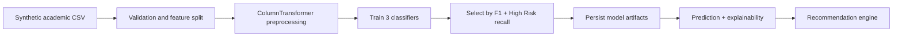

# SmartEdu AI

Explainable Student Performance Prediction and Personalized Academic Guidance Recommendation System.

SmartEdu AI is an academic support project that predicts student risk levels, explains likely risk factors, and generates personalized study recommendations. Phase 1 focuses on a clean Python ML foundation: synthetic data generation, preprocessing, model training, evaluation, prediction, explainability fallback logic, and recommendation rules.

> SmartEdu AI is an academic support tool. Predictions are probabilistic and should be used by mentors and educators as guidance, not as a final decision about a student.

## Phase 1 Features

- Generates 300 realistic synthetic student records.
- Creates logical risk labels: `Low Risk`, `Medium Risk`, `High Risk`.
- Trains Logistic Regression, Random Forest, and Gradient Boosting models.
- Selects the best model using macro F1-score and High Risk recall.
- Saves trained artifacts in `ml/model_registry/`.
- Supports single-student prediction with confidence, top factors, explanation, and recommendations.
- Includes SHAP-aware explainability with a robust fallback when SHAP is unavailable.
- Includes pytest coverage for preprocessing, prediction, and recommendations.

## Phase Status

| Phase | Scope | Status |
| --- | --- | --- |
| Phase 1 | ML foundation, data generation, model training, explainability, recommendations | Complete |
| Phase 2 | FastAPI backend, SQLite persistence, prediction API, analytics, API tests | Complete |
| Phase 3 | Streamlit dashboard, CSV upload UI, analytics views, recommendations UI | Complete |
| Phase 4 | GenAI mentor chatbot | Planned |
| Phase 5 | Documentation and interview packaging | Planned |
| Phase 6 | Deployment and MLOps | Planned |

## Phase 2 Backend Features

- FastAPI app with health and root routes.
- SQLite database tables created automatically on startup.
- Student CRUD API with latest academic record support.
- Single-student risk prediction API using saved Phase 1 model artifacts.
- Batch CSV prediction API.
- Recommendation generation and retrieval.
- Analytics summary, risk distribution, department analytics, and subject performance routes.
- API tests using FastAPI `TestClient`.

## Phase 3 Dashboard Features

- Streamlit multi-page dashboard with a professional academic intelligence layout.
- Executive overview with backend health, student metrics, risk distribution, and weak subject insights.
- Student explorer with filters, profile view, latest academic record, and quick prediction action.
- Manual risk prediction form with Low, Medium, and High Risk demo samples.
- Batch CSV upload page using the backend `/predict/batch` route.
- Explainable AI page showing top risk factors and student-friendly explanation.
- Recommendations page with action plans, 7-day plan, 30-day plan, resources, mentor note, and downloads.
- System status page showing backend health, model metrics, and artifact availability.

Screenshot placeholders:

- `docs/screenshots/executive_overview.png`
- `docs/screenshots/risk_prediction.png`
- `docs/screenshots/batch_upload.png`
- `docs/screenshots/recommendations.png`

## Project Structure

```text
SmartEdu Ai/
├── README.md
├── requirements.txt
├── .env.example
├── data/
│   ├── generate_sample_data.py
│   ├── sample_students.csv
│   ├── raw/
│   │   └── .gitkeep
│   └── processed/
│       └── .gitkeep
├── ml/
│   ├── __init__.py
│   ├── preprocessing.py
│   ├── train_model.py
│   ├── evaluate_model.py
│   ├── predict.py
│   ├── recommendation_engine.py
│   ├── explainability.py
│   └── model_registry/
│       ├── .gitkeep
│       ├── model.joblib
│       ├── preprocessor.joblib
│       ├── metrics.json
│       └── feature_names.json
├── backend/
│   ├── main.py
│   ├── config.py
│   ├── database.py
│   ├── models/
│   ├── schemas/
│   ├── routes/
│   ├── services/
│   └── utils/
├── dashboard/
│   ├── app.py
│   ├── api_client.py
│   ├── config.py
│   ├── state.py
│   ├── components/
│   ├── pages/
│   └── utils/
└── tests/
    ├── test_preprocessing.py
    ├── test_prediction.py
    ├── test_recommendations.py
    ├── test_api.py
    └── test_dashboard_utils.py
```

## Setup

```bash
python -m venv .venv
.venv\Scripts\activate
pip install -r requirements.txt
```

On macOS/Linux:

```bash
python -m venv .venv
source .venv/bin/activate
pip install -r requirements.txt
```

## Run Commands

Generate the dataset:

```bash
python data/generate_sample_data.py
```

Train models and save the best artifacts:

```bash
python ml/train_model.py
```

Evaluate the saved model:

```bash
python ml/evaluate_model.py
```

Run tests:

```bash
pytest
```

Run the backend:

```bash
uvicorn backend.main:app --reload
```

Run the dashboard in another terminal:

```bash
streamlit run dashboard/app.py
```

API docs:

```text
http://127.0.0.1:8000/docs
```

Dashboard URL:

```text
http://localhost:8501
```

Import check:

```bash
python -c "from backend.main import app; print(app.title)"
```

Expected output:

```text
SmartEdu AI Backend
```

## API Routes

| Method | Route | Purpose |
| --- | --- | --- |
| `GET` | `/` | Backend root message. |
| `GET` | `/health` | Health check and model availability. |
| `GET` | `/students` | List students. |
| `GET` | `/students/{student_id}` | Get one student with latest academic record. |
| `POST` | `/students` | Create student and academic record. |
| `PUT` | `/students/{student_id}` | Update student profile and/or academic record. |
| `DELETE` | `/students/{student_id}` | Delete student and related records. |
| `POST` | `/predict` | Predict one student's academic risk. |
| `POST` | `/predict/batch` | Upload CSV and predict in batch. |
| `GET` | `/recommendations/{student_id}` | Get latest stored recommendation. |
| `POST` | `/recommendations/generate` | Generate recommendation from one academic record. |
| `GET` | `/analytics/summary` | Overall student and risk summary. |
| `GET` | `/analytics/risk-distribution` | Risk counts from stored predictions. |
| `GET` | `/analytics/department/{department}` | Department-level metrics. |
| `GET` | `/analytics/subject-performance` | Average subject scores. |

## Dashboard Pages

| Page | Purpose |
| --- | --- |
| Executive Overview | Shows backend health, student counts, risk distribution, metrics, and workflow. |
| Student Explorer | Search/filter students and run quick predictions. |
| Risk Prediction | Manual prediction form with demo samples. |
| Batch Upload | Upload CSV, run batch predictions, and download reports. |
| Explainable AI | Show top factors and student-friendly explanation. |
| Recommendations | Display saved or generated academic guidance. |
| System Status | Show API health, model metrics, and artifact status. |

## Demo Workflow

1. Start backend: `uvicorn backend.main:app --reload`
2. Start dashboard: `streamlit run dashboard/app.py`
3. Open Executive Overview and confirm backend is online.
4. Open Risk Prediction, load the High Risk sample, and click Predict.
5. Open Recommendations and select the predicted student.
6. Open Batch Upload and use `data/sample_students.csv`.
7. Open System Status to show model metrics and artifacts.

## Example Predict Request

```json
{
  "student_id": "STU001",
  "name": "Test Student",
  "department": "Computer Science",
  "year": 3,
  "semester": 5,
  "gender": "Female",
  "attendance_percentage": 62,
  "internal_marks_average": 55,
  "assignment_completion_rate": 58,
  "quiz_average": 52,
  "previous_semester_gpa": 6.1,
  "current_gpa": 5.8,
  "study_hours_per_week": 6,
  "backlogs": 2,
  "late_submissions": 5,
  "participation_score": 45,
  "subject_math_score": 55,
  "subject_programming_score": 49,
  "subject_electronics_score": 60,
  "subject_communication_score": 66,
  "subject_lab_score": 58,
  "library_usage_hours": 2,
  "lms_login_frequency": 4,
  "parent_meeting_count": 1,
  "mentor_meeting_count": 1,
  "extracurricular_hours": 2,
  "stress_level": 8,
  "sleep_hours": 5.2,
  "internet_access": "Yes"
}
```

Example curl:

```bash
curl -X POST "http://127.0.0.1:8000/predict" \
  -H "Content-Type: application/json" \
  -d @example_student.json
```

## Database

Phase 2 uses SQLite by default through:

```text
sqlite:///./smartedu.db
```

The backend creates tables automatically on startup. The database file is ignored by git because it is a local runtime artifact.

## Dataset Schema

| Column | Meaning |
| --- | --- |
| `student_id` | Unique student identifier. |
| `name` | Synthetic student name. |
| `department` | Academic department. |
| `year` | Current year of study. |
| `semester` | Current semester. |
| `gender` | Synthetic gender category. |
| `attendance_percentage` | Overall attendance percentage. |
| `internal_marks_average` | Average internal assessment marks. |
| `assignment_completion_rate` | Assignment completion percentage. |
| `quiz_average` | Average quiz score. |
| `previous_semester_gpa` | Previous semester GPA on a 10-point scale. |
| `current_gpa` | Current GPA on a 10-point scale. |
| `study_hours_per_week` | Weekly study hours outside class. |
| `backlogs` | Number of unresolved backlogs. |
| `late_submissions` | Count of late submissions. |
| `participation_score` | Class participation score. |
| `subject_math_score` | Mathematics score. |
| `subject_programming_score` | Programming score. |
| `subject_electronics_score` | Electronics score. |
| `subject_communication_score` | Communication score. |
| `subject_lab_score` | Lab performance score. |
| `library_usage_hours` | Weekly library usage. |
| `lms_login_frequency` | LMS logins per week. |
| `parent_meeting_count` | Parent meetings in the term. |
| `mentor_meeting_count` | Mentor meetings in the term. |
| `extracurricular_hours` | Weekly extracurricular hours. |
| `stress_level` | Self-reported stress level from 1 to 10. |
| `sleep_hours` | Average sleep hours per night. |
| `internet_access` | Whether reliable internet access is available. |
| `risk_label` | Target label: Low Risk, Medium Risk, or High Risk. |

## ML Architecture



## Model Artifacts

Training saves:

- `ml/model_registry/model.joblib`
- `ml/model_registry/preprocessor.joblib`
- `ml/model_registry/metrics.json`
- `ml/model_registry/feature_names.json`

## Future Phases

- Optional GenAI mentor chatbot.
- Docker and GitHub Actions CI.

## Known Limitations

- No login/auth yet.
- SQLite is local-only.
- The included dataset is synthetic.
- Predictions are probabilistic and must not be used as final judgment about a student.
- Dashboard depends on the FastAPI backend being running for live data and predictions.
- GenAI mentor support is planned for a future phase.

## Resume Bullets

- Built an explainable ML pipeline for early student academic risk detection using Scikit-learn, model comparison, and persisted inference artifacts.
- Engineered realistic synthetic education data with rule-based target labeling to reflect attendance, GPA, assignments, backlogs, stress, and sleep patterns.
- Implemented personalized academic recommendation logic with test coverage for preprocessing, inference, and guidance generation.

## Interview Pitch

SmartEdu AI is an academic support system that identifies students who may need help before problems become severe. In Phase 1, I built the ML foundation: a realistic synthetic dataset, preprocessing pipeline, three model candidates, model selection based on F1 and High Risk recall, explainability fallbacks, and personalized recommendations. The project is designed to grow into a full FastAPI and dashboard product while keeping the ML layer modular and testable.
