# SmartEdu AI v2.0 Master Blueprint

## Table of Contents
1. [Executive Summary](#executive-summary)
2. [Why SmartEdu AI Exists](#why-smartedu-ai-exists)
3. [Vision](#vision)
4. [Target Users](#target-users)
5. [Problems Being Solved](#problems-being-solved)
6. [Complete Product Journey](#complete-product-journey)
7. [Feature Inventory](#feature-inventory)
8. [AI Architecture](#ai-architecture)
9. [Machine Learning Architecture](#machine-learning-architecture)
10. [Frontend Architecture](#frontend-architecture)
11. [Backend Architecture](#backend-architecture)
12. [Database Architecture](#database-architecture)
13. [Security Architecture](#security-architecture)
14. [Deployment Architecture](#deployment-architecture)
15. [AI Cost Optimization](#ai-cost-optimization)
16. [Roadmap](#roadmap)
17. [Long-Term Vision](#long-term-vision)
18. [Technical Debt and Risks](#technical-debt-and-risks)
19. [Coding Standards](#coding-standards)
20. [Future Contributors Guide](#future-contributors-guide)
21. [Final Perspective](#final-perspective)

## Executive Summary

SmartEdu AI is a student intelligence platform designed to help learners understand where they stand academically, why they are struggling, what to do next, and how to build a better long-term future. The project started as a local-first academic risk prediction system and has already matured into a multi-surface product with a FastAPI backend, a React and TypeScript frontend, a scikit-learn ML pipeline, a mentor interview engine, provider support for Groq and OpenRouter, local SQLite persistence, and a Streamlit backup dashboard.

v1.0.0 established the stable foundation. v2.0 is the transition from a strong local product into a production-grade platform: secure, observable, scalable, testable, and maintainable. The goal is not simply to "host" the current application. The goal is to evolve SmartEdu AI into an intelligent educational companion that can be trusted by students, mentors, faculty, counselors, and institutions.

This document is the master blueprint for that evolution. It is intentionally detailed so future contributors, engineers, and product owners can align on the system's purpose, structure, constraints, and implementation order before writing code.

## Why SmartEdu AI Exists

SmartEdu AI exists because students rarely need only a risk score. They need interpretation, direction, and momentum.

Most educational tools answer isolated questions:

- Is this student at risk?
- What is the attendance percentage?
- What is the GPA?
- Which subject is weak?

SmartEdu AI tries to answer the deeper question:

**What should this student do next, and why?**

The project treats academic performance as a living system rather than a static number. A student does not only need a prediction that they are high risk. They need help understanding:

- what patterns are causing the risk
- whether the issue is academic, behavioral, emotional, or contextual
- which strengths can be used as leverage
- what subjects or skills need repair first
- what kind of projects could build confidence and employability
- which career path best matches their observed interest and behavior
- what a realistic weekly routine looks like

SmartEdu AI is meant to behave like a mentor, not a chatbot. That distinction matters.

### Why a Mentor Style Matters

A chatbot replies. A mentor guides.

A chatbot may answer the question literally. A mentor reads the situation, notices what is not being said, and helps the learner move forward with a smaller, clearer next step.

SmartEdu AI should:

- explain risk in human language
- show priorities instead of overwhelming the learner
- adapt to the student's current state
- reinforce a practical path, not an abstract ideal
- make guidance feel personal and actionable

That is the reason this platform exists.

## Vision

SmartEdu AI's long-term vision is a progression from academic analytics to an intelligent student companion.

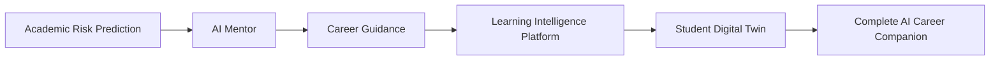

### Stage 1: Academic Risk Prediction

The first stage identifies students who may be struggling based on:

- attendance
- marks
- assignment completion
- quiz performance
- GPA
- study habits
- backlogs
- stress and sleep

This stage answers:

- Who is at risk?
- How severe is the risk?
- Which features matter most?

### Stage 2: AI Mentor

The mentor engine turns prediction into conversation.

Instead of only saying "high risk," SmartEdu AI asks:

- what subjects feel natural
- which learning style fits the student
- what kind of work gives them energy
- which obstacles are blocking progress

This stage transforms data into context.

### Stage 3: Career Guidance

The system begins mapping academic reality to career direction.

It should be able to suggest paths like:

- software engineering
- data science
- product analysis
- embedded systems
- UI/UX
- cyber security
- research-oriented pathways

Guidance should be based on:

- interest
- skill signals
- academic performance
- consistency
- readiness for specific paths

### Stage 4: Learning Intelligence Platform

At this stage SmartEdu AI becomes a platform that understands how the student learns.

The system should track:

- knowledge gaps
- confidence levels
- speed of progress
- recurring weaknesses
- likely next failures

This is where continuous planning matters.

### Stage 5: Student Digital Twin

The "digital twin" is not a gimmick. It is the idea that SmartEdu AI can maintain a structured model of the student's:

- strengths
- weaknesses
- preferences
- habits
- career intent
- academic risk
- progress over time

The twin is updated through reports, predictions, mentor interviews, and new records.

### Stage 6: Complete AI Career Companion

The final platform should support:

- academic planning
- career exploration
- project recommendations
- interview preparation
- portfolio planning
- mentor collaboration
- institutional analytics

This is the point where SmartEdu AI can become a durable product, not just a demo.

## Target Users

SmartEdu AI should serve multiple user groups with different needs, levels of expertise, and expectations.

| User | Primary Needs | Main Value |
|---|---|---|
| Student | Know risk, understand strengths, get a plan | Personal guidance |
| School Student | Build learning habits early | Early direction |
| College Student | Career path clarity and project planning | Employability guidance |
| Engineering Student | Subject and skill prioritization | Technical roadmap |
| Arts Student | Career and skill mapping beyond marks | Direction and confidence |
| Medical Student | Learning structure and consistency | Focused planning |
| Mentor | Richer context for personalized guidance | Better counseling |
| Faculty | Understand academic intervention priorities | Support decisions |
| Career Counselor | Convert student signals into career advice | Faster advising |
| Training Placement Officer | Match students to roles and readiness | Placement preparation |
| Institution Administrator | Aggregate analytics and intervention status | Operational visibility |
| Parents | Understand progress without jargon | Transparency and support |

### Student Persona

Students are the primary audience. They need simple, motivating, non-judgmental guidance. They do not want raw model internals. They want to understand what to do next.

### School Student Persona

For younger students, the system should emphasize:

- confidence
- study habits
- foundational learning
- gentle intervention

### College Student Persona

College students often need career grounding. They are trying to connect:

- academics
- projects
- internships
- placement preparation
- long-term goals

### Engineering Student Persona

Engineering students often need:

- technical skill ordering
- project ideas
- lab and subject balance
- interview readiness

### Arts Student Persona

Arts students need guidance that respects non-technical pathways and broadens their career horizon. The system should support:

- communication
- business roles
- design
- policy
- analytics
- teaching

### Medical Student Persona

Medical students may need different pacing, high discipline, and stress-aware planning. SmartEdu AI should not overfit to tech-only assumptions.

### Mentor Persona

Mentors need:

- clear explanation of risk
- interview transcripts
- recommendation rationale
- readiness indicators
- intervention priorities

### Faculty Persona

Faculty need concise signals:

- who needs intervention
- what subject is weak
- where attendance or consistency is a concern

### Career Counselor Persona

Counselors need:

- path comparison
- interest detection
- skills to build first
- communication templates for guidance sessions

### Training and Placement Officer Persona

Placement officers need:

- batch readiness
- project strength
- internship potential
- career fit ranking

### Institution Administrator Persona

Admins need:

- program-level analytics
- department-level trends
- intervention workload
- adoption visibility

### Parents Persona

Parents should see:

- simple summary
- risks in plain language
- recommended support actions
- evidence of progress

## Problems Being Solved

SmartEdu AI exists to solve real educational friction, not just technical curiosity.

### Students do not know what to learn

Many students are overwhelmed by choices. They do not know whether to focus on:

- one subject
- DSA
- projects
- communication
- internships
- core fundamentals

SmartEdu AI narrows the path.

### Students choose careers blindly

Students often pick paths based on peer pressure, trends, or partial understanding. SmartEdu AI can connect observed behavior and performance to more realistic paths.

### Students lose motivation

When students do not see progress, they often disengage. A system that gives clear, smaller next steps can restore momentum.

### Students do not know their weaknesses

Marks alone do not always explain the problem. The platform should show whether the issue is:

- attendance
- consistency
- weak subjects
- low practice volume
- poor sleep
- high stress

### Students do not know what projects to build

Many students need projects that are:

- relevant
- achievable
- portfolio-friendly
- aligned with career goals

### Mentors cannot personalize advice at scale

Manual counseling is valuable but slow. SmartEdu AI supports mentors by pre-processing the signals and offering a structured summary.

### Reports are generic

Generic reports do not change behavior. SmartEdu AI should produce specific recommendations that reflect the student's actual state.

### Learning plans are not adaptive

One-size-fits-all plans fail. The system should adapt the plan to the student's current risk and goals.

## Complete Product Journey

The full product journey should feel like one connected system.

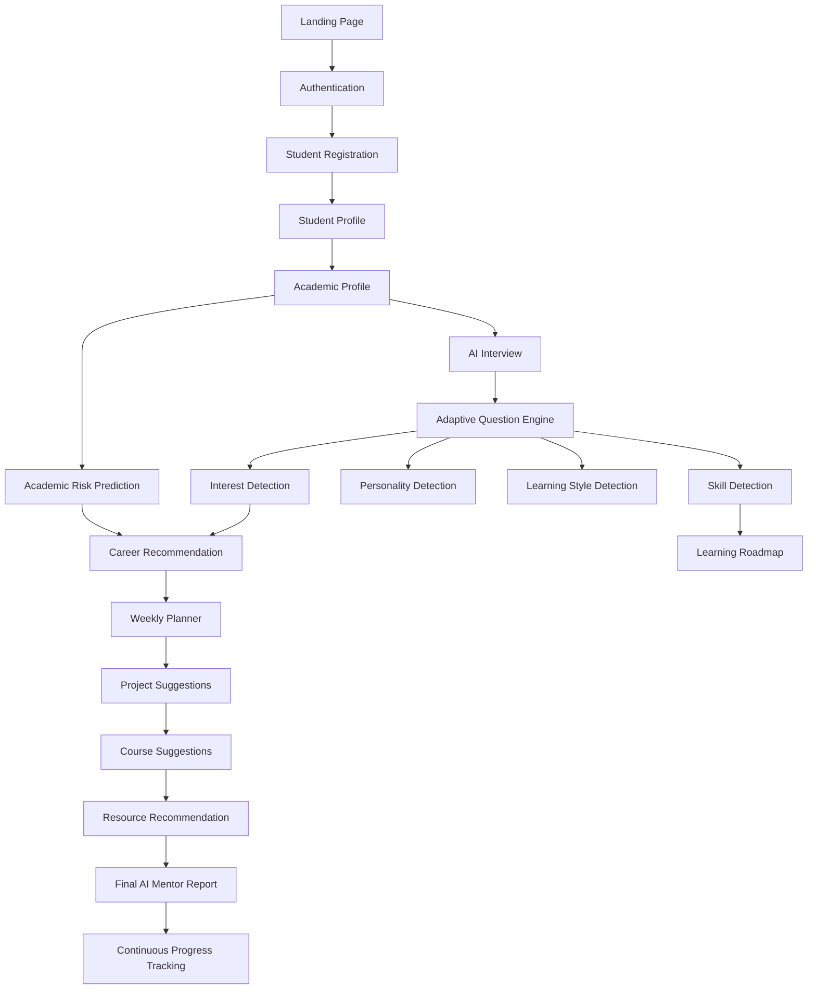

### Journey Description

The journey should begin with a clear landing page and move through authentication into a structured student profile. Once the profile is complete, the user should be able to:

- register or import academic information
- run a risk prediction
- begin the mentor interview
- receive an adaptive plan
- generate a report
- track progress over time

The important principle is that every step should feed the next step.

## Feature Inventory

The feature inventory below uses a simple status model:

- Implemented
- Planned
- Future

| Category | Feature | Status |
|---|---|---|
| Core | Landing page | Implemented |
| Core | FastAPI backend | Implemented |
| Core | React frontend | Implemented |
| Core | SQLite local persistence | Implemented |
| Core | Streamlit backup dashboard | Implemented |
| AI | Mentor interview engine | Implemented |
| AI | Groq provider support | Implemented |
| AI | OpenRouter provider support | Implemented |
| AI | Offline fallback engine | Implemented |
| AI | Prompt versioning | Planned |
| AI | Provider routing policy | Planned |
| AI | Structured output validation | Planned |
| ML | Risk prediction model | Implemented |
| ML | Explainability | Implemented |
| ML | Metrics tracking | Implemented |
| ML | Model registry | Implemented |
| ML | Retraining automation | Planned |
| Student | Student profile management | Implemented |
| Student | Batch upload | Implemented |
| Student | Personalized report | Implemented |
| Student | Progress tracking | Planned |
| Mentor | Interview session view | Implemented |
| Mentor | Mentor report view | Implemented |
| Mentor | Counseling history | Planned |
| Admin | System status | Implemented |
| Admin | Audit logs | Planned |
| Admin | Role management | Planned |
| Analytics | Summary dashboard | Implemented |
| Analytics | Subject trends | Implemented |
| Analytics | Institution-level insights | Planned |
| Reporting | PDF export | Planned |
| Reporting | Markdown export | Implemented |
| Reporting | TXT export | Implemented |
| Institution | Multi-tenant support | Future |
| Institution | Department dashboards | Planned |
| Future | Mobile-first companion app | Future |
| Future | Parent portal | Future |
| Future | LLM memory layer | Future |
| Future | Student digital twin | Future |

### Feature Inventory Notes

Some features are technically present in v1.0.0 but not production-ready. Those should still move from "implemented" to "production hardened" in v2.0.

## AI Architecture

SmartEdu AI's AI system should be treated as an orchestration stack, not a single model call.

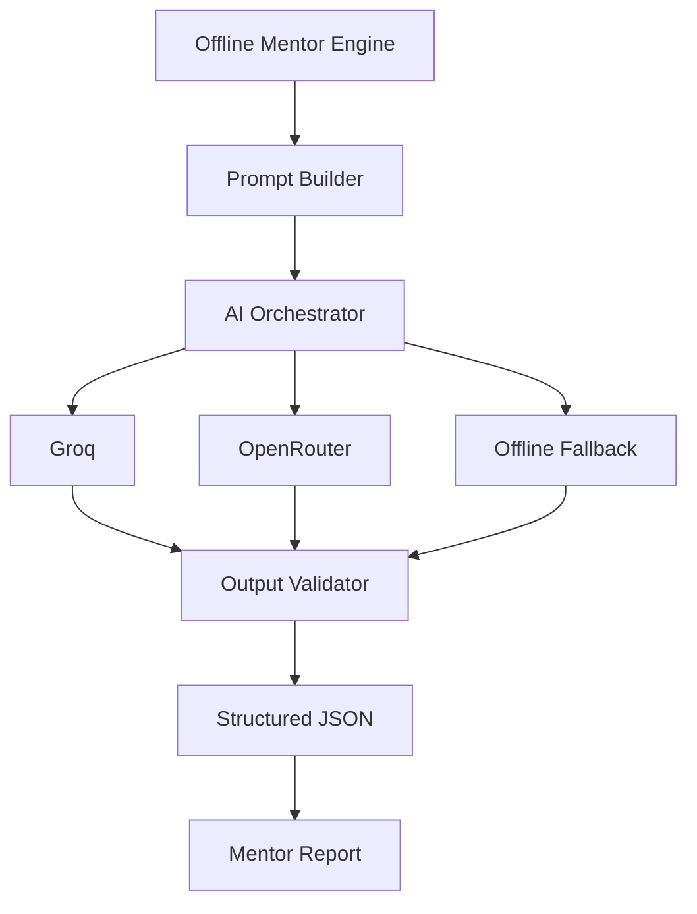

### Stage 1: Offline Mentor Engine

The offline engine ensures the system always has a fallback path. This is essential for:

- demos
- outages
- missing API keys
- rate limiting
- cost control

### Stage 2: Prompt Builder

The prompt builder transforms context into model instructions.

It should:

- include only relevant data
- enforce structured output
- separate system instructions from user context
- sanitize sensitive information

### Stage 3: AI Orchestrator

The orchestrator chooses which provider to use based on:

- configuration
- provider health
- cost policy
- response history
- timeout risk

### Stage 4: Groq

Groq should be the economical, fast default for many mentor interactions.

### Stage 5: OpenRouter

OpenRouter serves as a secondary hosted route and can be useful for model variety or fallback diversity.

### Stage 6: Offline Fallback

The offline fallback protects the user experience when:

- the key is missing
- the request fails
- the response is malformed
- the provider times out

### Stage 7: Output Validator

The validator should ensure that responses are:

- valid JSON
- schema compliant
- non-empty where required
- safe to persist

### Stage 8: Structured JSON

All AI outputs should be stored and exchanged as structured data, not free text blobs, whenever possible.

### Stage 9: Mentor Report

The mentor report should synthesize:

- risk
- career path
- skill gaps
- readiness
- roadmap
- project recommendations
- mentor advice

### AI Safety Principles

- No secrets in prompts
- No unvalidated output
- No provider-specific assumptions in frontend code
- No hidden prompt coupling between services

## Full System Architecture

This is the end-state production architecture for SmartEdu AI v2.0. It shows the main request path and the supporting services that must be available for a resilient production deployment.

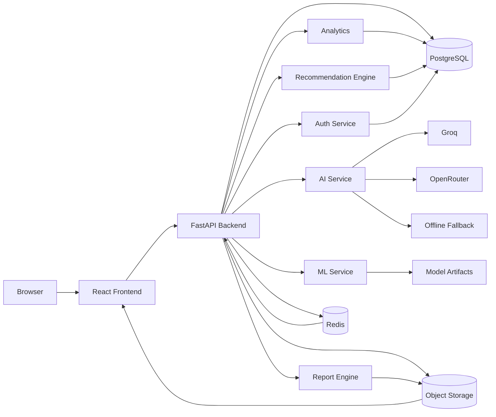

### System Notes

- The browser only talks to the frontend.
- The frontend only talks to the backend API.
- The backend decides which internal service to use.
- AI providers are never exposed directly to the frontend.
- PostgreSQL is the durable system of record.
- Redis handles caching, queues, and short-lived state.
- Object storage holds exports, generated reports, and large artifacts.

## AI Agent Architecture

v2.0 should evolve from a single mentor engine into a family of specialized agents coordinated by an AI orchestrator. The orchestrator decides which agent to invoke based on task type, context, and risk.

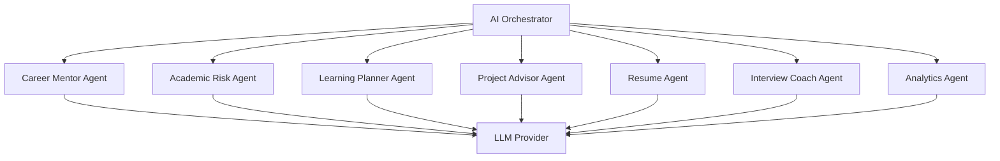

### Agent Roles

#### Career Mentor Agent
Responsible for:

- career path reasoning
- career fit comparison
- fit explanation in human language
- long-term direction

#### Academic Risk Agent
Responsible for:

- risk interpretation
- early intervention flags
- weak-area prioritization
- academic recovery guidance

#### Learning Planner Agent
Responsible for:

- weekly plans
- 30/60/90 day roadmaps
- habit formation
- adaptive progress updates

#### Project Advisor Agent
Responsible for:

- project recommendations
- portfolio alignment
- difficulty selection
- deliverable definition

#### Resume Agent
Responsible for:

- resume positioning
- evidence framing
- bullet suggestions
- skill-to-project mapping

#### Interview Coach Agent
Responsible for:

- interview prep
- likely question generation
- answer framing
- confidence building

#### Analytics Agent
Responsible for:

- cohort trends
- weak subject clustering
- intervention summaries
- institution-level insights

### Agent Principles

- Each agent should have one clear job.
- The orchestrator should choose the simplest agent that can solve the task.
- Agents should produce structured output where possible.
- Shared memory should be controlled, not implicit.

## Memory Architecture

SmartEdu AI needs memory so that advice improves over time instead of restarting from zero in every session.

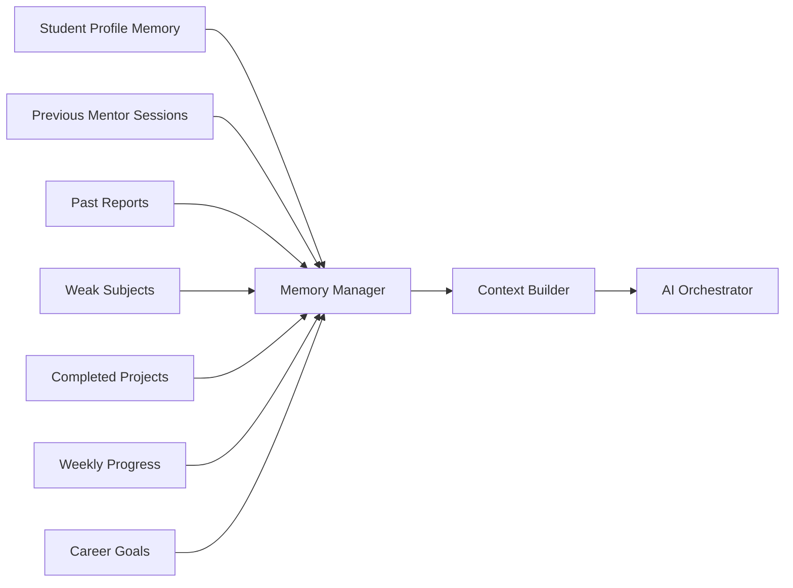

### Memory Layers

#### Student Profile Memory
Stores the stable identity and baseline context:

- name
- department
- year
- academic history
- known preferences

#### Previous Mentor Sessions
Stores:

- questions asked
- answers given
- detected interests
- dominant career direction
- readiness progression

#### Past Reports
Stores the final guidance history so the system can avoid repeating itself and can measure growth.

#### Weak Subjects
Stores recurring weak points so that future advice can stay focused.

#### Completed Projects
Stores evidence of real progress and portfolio construction.

#### Weekly Progress
Stores short-term improvements and deviations from the plan.

#### Career Goals
Stores the user's desired direction and any shifts in intent over time.

### Memory Governance

- Memory should be explicit, not magical.
- User-visible context should be summarized before storage.
- Sensitive details should be minimized and redacted where appropriate.
- Old context should be compacted so prompts do not grow without bound.

## RAG Architecture

Future SmartEdu AI should use retrieval-augmented generation so the mentor engine can ground advice in trusted documents instead of relying only on prompt memory.

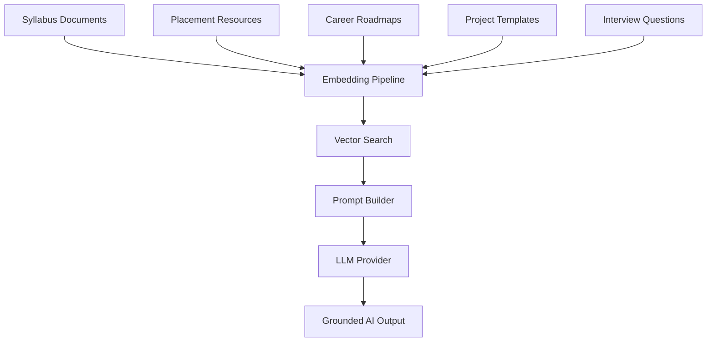

### RAG Data Sources

- syllabus documents
- placement resources
- career roadmaps
- project templates
- interview question banks

### RAG Flow

1. A user asks a question or starts a mentor flow.
2. Relevant documents are embedded and retrieved.
3. The prompt builder inserts only the best evidence.
4. The LLM generates a grounded response.
5. The output validator checks that the answer is well-formed and consistent.

### RAG Benefits

- Better factual grounding
- Better institutional customization
- Better repeatability
- Better explainability

## Sequence Diagrams

### Risk Prediction Flow

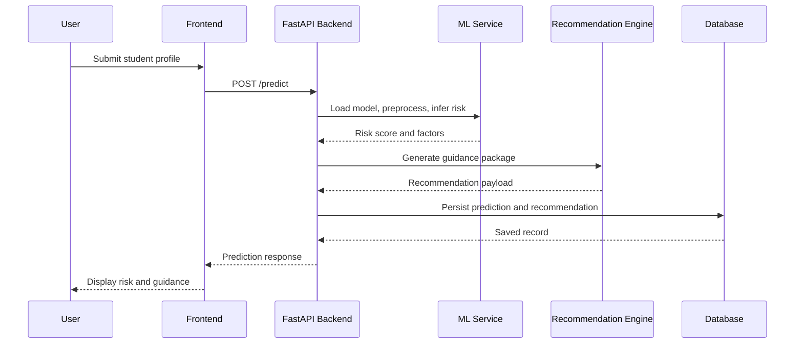

### AI Mentor Interview Flow

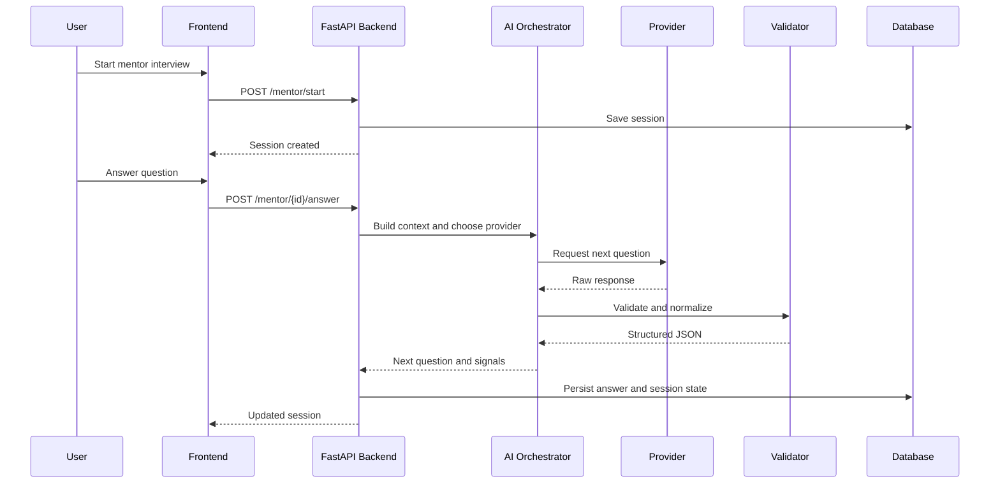

### Mentor Report Generation Flow

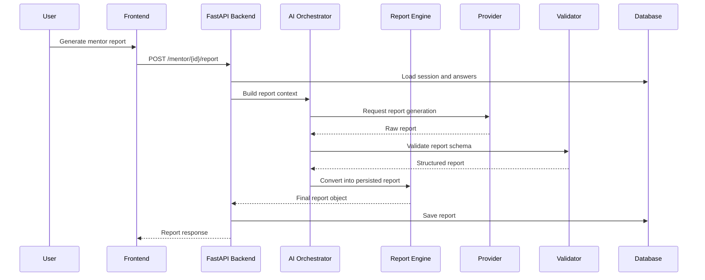

### Future Login/Auth Flow

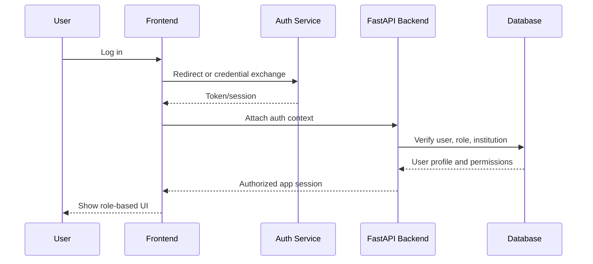

## Non-Functional Requirements

SmartEdu AI v2.0 should be designed against explicit production targets.

| Area | Target |
|---|---|
| Performance | Common API responses under 300 ms excluding AI calls |
| Availability | 99.5% or better for core API services in production target state |
| Scalability | Support multi-user concurrent access without SQLite bottlenecks |
| Security | No secrets in frontend, logs, or tracked example files |
| Maintainability | Feature-based folders, clear service boundaries, versioned APIs |
| Accessibility | Keyboard navigable UI, readable contrast, semantic controls |
| Reliability | Offline fallback for AI, migration-safe persistence, graceful error handling |
| Observability | Structured logs, trace IDs, metrics, alerting, and audit events |

### Target Notes

- Performance targets should exclude external provider latency where applicable.
- Reliability should include degraded-mode behavior, not just happy-path uptime.
- Observability should make AI failures and fallback rates visible.

## Production Readiness Checklist

### Backend

- [ ] Versioned API routes exist
- [ ] Structured error schema is standardized
- [ ] Rate limiting is enabled
- [ ] Request validation is strict
- [ ] Background jobs are available for heavy tasks
- [ ] Provider fallback is tested
- [ ] Audit logging is present

### Frontend

- [ ] Auth-aware route protection
- [ ] Route-level code splitting
- [ ] Error boundaries for major routes
- [ ] Accessible form controls
- [ ] Empty/loading/error states on all data pages
- [ ] No secrets in frontend env

### Database

- [ ] PostgreSQL schema defined
- [ ] Alembic migrations in place
- [ ] Indexes added for hot queries
- [ ] Backup strategy tested
- [ ] Migration rollback plan documented

### AI

- [ ] Provider routing policy defined
- [ ] Structured output validation enabled
- [ ] Fallback chain verified
- [ ] Prompt versions tracked
- [ ] Token budgets enforced
- [ ] Memory policy documented

### ML

- [ ] Training pipeline reproducible
- [ ] Evaluation metrics stored
- [ ] Artifact registry versioned
- [ ] Explainability outputs stable
- [ ] Drift monitoring planned

### Security

- [ ] Secrets manager or env discipline enforced
- [ ] MFA for privileged users
- [ ] Role-based authorization
- [ ] CSRF strategy defined
- [ ] PII redaction policy established
- [ ] Dependency scanning enabled

### Deployment

- [ ] Docker images available
- [ ] Staging environment exists
- [ ] Production rollout plan documented
- [ ] Rollback procedure tested
- [ ] Env-specific config managed safely

### Monitoring

- [ ] App logs structured
- [ ] Error tracking integrated
- [ ] Metrics dashboard exists
- [ ] AI fallback rate observed
- [ ] DB latency observed
- [ ] Alert thresholds defined

### Documentation

- [ ] Master blueprint updated
- [ ] Setup guide accurate
- [ ] Release notes maintained
- [ ] Contributor guide present
- [ ] Architecture decisions documented

## Decision Records

### Why FastAPI

FastAPI is a strong fit because it gives:

- high developer productivity
- excellent request validation
- easy OpenAPI generation
- strong Python ecosystem alignment
- good performance for API workloads

### Why React

React is a good choice because:

- the team already has a working frontend
- the component ecosystem is strong
- the app benefits from reusable stateful UI
- charts and dashboards are easy to express

### Why PostgreSQL for v2

PostgreSQL is the right v2 database because:

- SQLite does not scale well for concurrent production writes
- PostgreSQL supports robust relational integrity
- migrations are stronger
- analytics queries are more reliable

### Why Redis Later

Redis should be added after the base production stack because it solves:

- caching
- background work coordination
- rate limiting
- short-lived session state

### Why Groq / OpenRouter

Groq and OpenRouter give the project:

- hosted model flexibility
- vendor diversity
- cost routing options
- fallback resilience

### Why SQLite Only for Local v1

SQLite is perfect for local v1 because it is:

- simple
- portable
- easy to reset
- ideal for demo and test workflows

### Why Streamlit is Backup Only

Streamlit remains a backup interface because:

- the React frontend is the primary product surface
- Streamlit is useful as a fallback and internal tool
- keeping both active prevents losing demo accessibility

## Future Contributors Guide

Before changing code, future contributors should read the blueprint and answer:

1. What user problem am I solving?
2. Does this affect security or secrets?
3. Does this change the API contract?
4. Does this need a migration?
5. Does this need tests?
6. Does this need monitoring or rollback support?

Contributors should understand that SmartEdu AI is a product system, not a pile of isolated scripts. Each change should improve the student experience, not merely satisfy a technical preference.

## Final Perspective

SmartEdu AI is meant to help students think more clearly about themselves, their progress, and their future.

If v1 established that the idea works, v2 must prove that the system can be trusted in the real world.

That means:

- secure by default
- observable in production
- resilient under failure
- understandable to users
- maintainable by contributors
- affordable to run

The long-term ambition is not just to predict student outcomes. It is to help shape better ones.

## Machine Learning Architecture

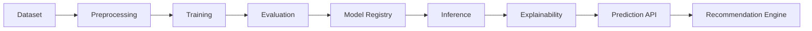

### Dataset

The dataset is synthetic in v1.0.0. For v2.0, the system should be designed to support:

- synthetic dev data
- institution-supplied real data
- anonymized imports

### Preprocessing

The preprocessing layer should:

- coerce missing values
- encode categorical variables
- normalize where needed
- keep feature names stable

### Training

Training should remain reproducible and tracked. Model selection should consider:

- macro F1
- high-risk recall
- calibration
- interpretability

### Evaluation

Evaluation should report:

- class metrics
- confusion matrix
- risk recall
- calibration notes
- drift indicators

### Model Registry

Model artifacts should be versioned and validated before deployment:

- model file
- preprocessor
- feature names
- metrics
- evaluation report

### Inference

Inference should be:

- fast
- deterministic
- logged
- version-aware

### Explainability

Explainability should provide human-readable reasons for the prediction. It should not be purely mathematical output.

### Prediction API

The prediction API should be stable, versioned, and safe for batch use.

### Recommendation Engine

The recommendation engine should transform risk category and student features into:

- action plan
- weekly plan
- roadmap
- resources
- mentor note

## Frontend Architecture

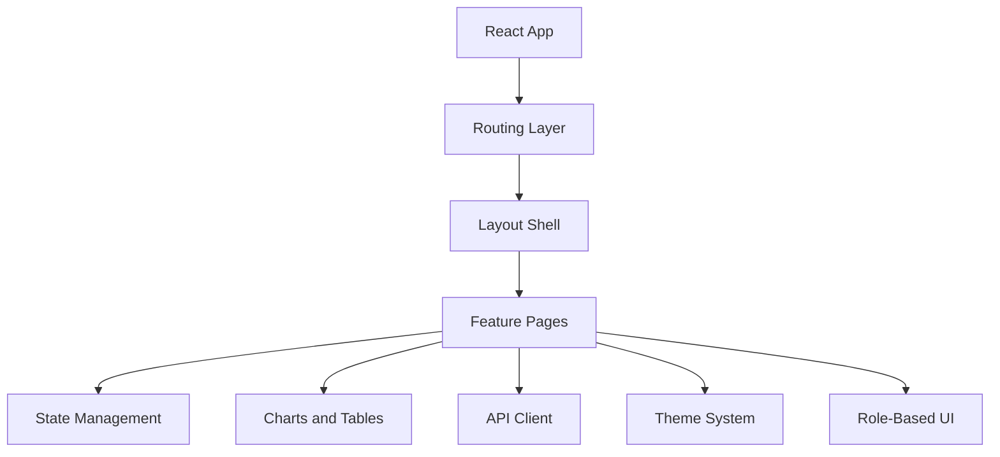

### React

React should remain the main presentation layer.

### TypeScript

TypeScript should be used to keep API payloads, page props, and chart structures stable.

### Tailwind CSS

Tailwind is appropriate for the current design system, but v2.0 should keep utility usage disciplined and token-driven.

### Routing

Routes should be grouped by feature domain and guarded by authentication.

### Component System

The component library should have:

- buttons
- cards
- badges
- tables
- empty states
- loading states
- charts

### Theme System

The theme system should support:

- light mode
- dark mode
- user preference persistence

### Authentication

The frontend should never hold provider secrets. It should only know about user identity and access state.

### State Management

State should be split between:

- server state
- UI state
- auth/session state

### Charts

Charts should load lazily where appropriate and use consistent color semantics.

### API Client

The API client should centralize base URL handling, error normalization, and authentication headers.

### Role-Based UI

Different users should see different navigation and actions.

## Backend Architecture

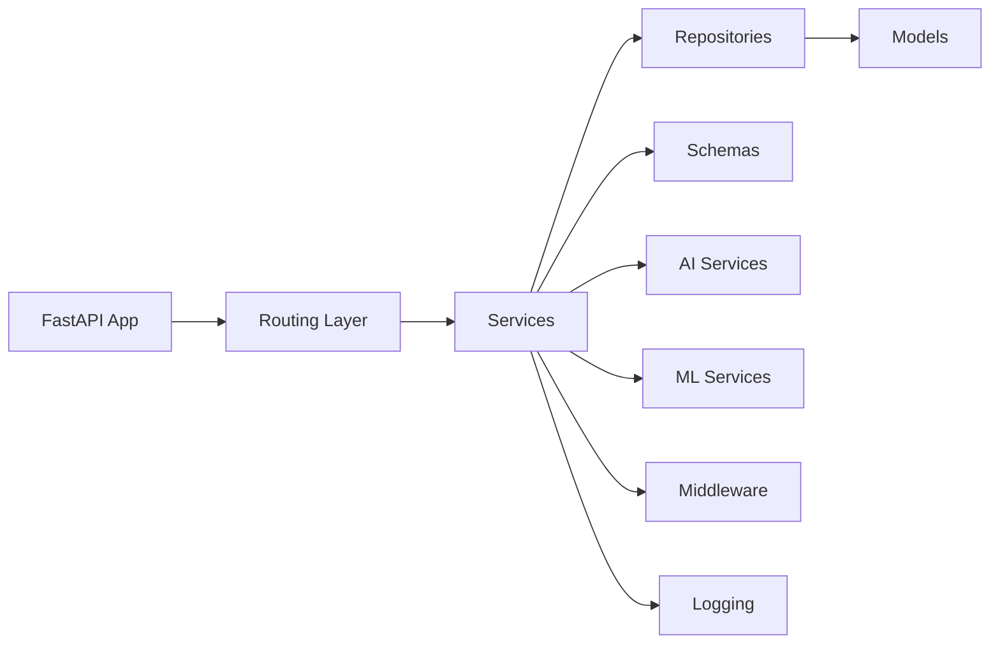

### FastAPI

FastAPI is the main backend framework and should remain so unless future scale justifies a different edge or service split.

### Routing

Routes should be versioned and organized by domain:

- health
- students
- predictions
- recommendations
- mentor
- analytics

### Services

Business logic should live in services, not route handlers.

### Repositories

Database access should be abstracted through repository helpers where complexity grows.

### Models

ORM models should map cleanly to production tables and maintain auditability.

### Schemas

Schemas should be the source of truth for input/output contracts.

### Validation

Validation should happen at the edge, before model or provider calls are made.

### Error Handling

Errors should be:

- actionable
- safe
- consistent
- not leaky

### Middleware

Middleware should handle:

- CORS
- request tracing
- auth context
- rate limiting hooks

### Logging

Logs should be structured and should never contain secrets.

### AI Services

AI services should mediate provider selection, fallback, and output validation.

### ML Services

ML services should handle:

- artifact loading
- inference
- explanation
- batch prediction

## Database Architecture

### Current State: SQLite

SQLite is the correct local development choice. It keeps v1.0.0 easy to run and demo.

### v2.0 Goal: PostgreSQL

PostgreSQL should be used for:

- concurrent writes
- production durability
- stronger relational integrity
- migrations
- analytics scale

### ER Diagram

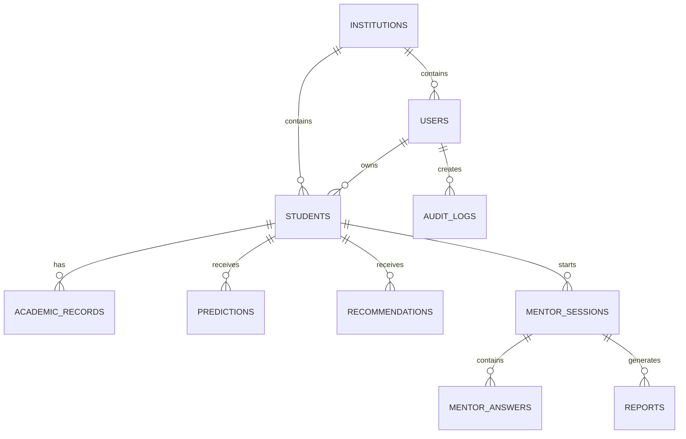

### Tables

#### Students

Stores identity-level student records:

- student ID
- name
- department
- year
- semester
- gender

#### Academic Records

Stores academic and behavior metrics over time:

- attendance
- marks
- assignment completion
- GPA
- backlogs
- stress
- sleep

#### Predictions

Stores prediction output and metadata:

- risk category
- probability
- confidence
- top factors
- explanation

#### Recommendations

Stores downstream guidance:

- summary
- action plan
- weekly plan
- resources
- mentor note

#### Mentor Sessions

Tracks interview lifecycle:

- start time
- current question
- clarity score
- status
- dominant path

#### Reports

Stores final mentor reports and structured outputs.

#### Users

Stores auth users and role assignments.

#### Roles

Separates access and permissions.

#### Institutions

Supports future multi-tenant deployment.

#### Audit Logs

Tracks sensitive events and administrative actions.

## Security Architecture

Security is a first-class system requirement.

### Authentication

Use secure auth with clear session handling and role separation.

### Authorization

Every role should have explicit access rules.

### JWT

If JWT is used, it should be short-lived and ideally stored in httpOnly cookies or a similarly safe session mechanism.

### OAuth

OAuth should be the preferred identity entry path for institutions that want it.

### Google Login

Google login should be production-configured, not demo-only.

### Secrets

Secrets should live only in:

- backend `.env`
- secret manager
- deployment environment variables

### Environment Variables

Frontend env should only contain non-secret public values.

### Prompt Injection

AI prompts must assume user input is hostile until validated.

### Rate Limiting

Rate limiting should protect:

- login
- mentor chat
- report generation
- batch upload

### Input Validation

All uploaded files and forms should be validated before use.

### SQL Injection

Prevented by parameterized queries and ORM discipline.

### XSS

All render surfaces should escape content or sanitize rich text.

### CSRF

If cookie sessions are used, CSRF controls must be added.

### PII Protection

Minimize and redact student personal information wherever possible.

## Deployment Architecture

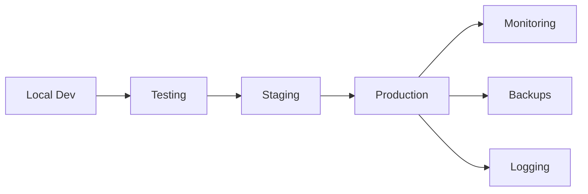

### Environments

- Local
- Development
- Testing
- Staging
- Production

### Docker

Docker should provide parity between environments.

### Docker Compose

Use Docker Compose for local full-stack development.

### GitHub Actions

Use GitHub Actions for:

- tests
- build
- security scanning
- release automation

### Vercel

Vercel is suitable for static frontend deployment if the frontend remains a SPA.

### Render / Railway

Either can host the FastAPI service if infrastructure simplicity matters.

### PostgreSQL

Use a managed PostgreSQL service in production.

### Redis

Use Redis for caching and background job coordination.

### Object Storage

Use object storage for exports, report files, and artifacts.

### Monitoring

Add metrics and alerting from day one of production.

### Logging

Use structured logs and request IDs.

### Backups

Automated backups should be mandatory for production PostgreSQL.

## AI Cost Optimization

AI cost control is part of the architecture, not a nice-to-have.

### Model Routing

Route by task complexity:

- small model for quick follow-ups
- larger model for report generation
- offline model for fallback

### Cheap Model

Use `llama-3.1-8b-instant` for economical online mentor steps.

### Medium Model

Use a mid-tier model for more nuanced guidance when needed.

### Premium Model

Use `llama-3.3-70b-versatile` for the most important report generation or premium-tier interactions.

### Offline Engine

Keep the offline engine strong enough to be useful when providers are unavailable.

### Caching

Cache safe repeated outputs and summaries.

### Conversation Memory

Summarize long conversations rather than resending the full history every time.

### Prompt Compression

Keep prompts short and structured.

### Token Budgeting

Use strict token budgets per operation.

### Fallback Strategy

Fallback strategy should be automatic and graceful.

## Roadmap

### v1.0

Local stable release. Establishes the baseline product and architecture.

### v1.1

Security and env hardening, especially secret hygiene and safer provider config.

### v1.2

Backend reliability improvements and clearer error handling.

### v1.3

Authentication foundation and session security.

### v1.4

Database migration preparation and schema normalization.

### v1.5

AI orchestration hardening and output validation.

### v2.0

Production-grade launch readiness:

- PostgreSQL
- real auth
- logging
- monitoring
- CI/CD
- background jobs
- hardened AI routing
- improved frontend performance

## Long-Term Vision

SmartEdu AI can evolve into:

- a SaaS platform
- a university product
- a placement intelligence platform
- an AI learning platform
- a startup
- a global product

The long-term path depends on whether the product stays useful after the novelty of the UI wears off. The answer must come from retention, trust, and real educational value.

## Technical Debt and Risks

### Current Limitations

- SQLite is local-first
- real auth is still future work
- deployment is not yet productionized
- dataset is synthetic
- AI provider keys are local-only

### Future Improvements

- Postgres migration
- multi-tenant design
- better AI caching
- report background jobs
- role-based dashboards

### Known Risks

- provider outages
- AI output drift
- schema mismatch
- data quality issues
- overfitting to synthetic data

### Scaling Challenges

- larger student batches
- more mentor sessions
- report generation load
- analytics query volume

### Deployment Risks

- secret handling
- environment drift
- migration failures
- provider misconfiguration

### AI Risks

- prompt injection
- malformed JSON
- hallucinated advice
- provider cost spikes

### ML Risks

- synthetic-data bias
- feature drift
- inaccurate risk calibration

### Security Risks

- leaked secrets
- weak auth
- unvalidated file uploads
- missing rate limits

### Cost Risks

- repeated provider calls
- large report prompts
- long mentor sessions

## Coding Standards

### Naming Conventions

- Use clear, descriptive names.
- Avoid abbreviations unless standard.
- Keep route names and API names stable.

### Folder Conventions

- Group by feature/domain.
- Keep backend, frontend, ML, and docs separated.

### Testing Standards

- Every backend behavior change should have tests.
- Provider fallbacks should be tested.
- ML changes should validate inference and artifacts.

### Git Workflow

- Work on branches.
- Keep commits small and reviewable.
- Never commit secrets.

### Branch Strategy

- `main` for stable releases
- feature branches for implementation
- release tags for milestones

### Commit Style

- imperative tense
- concise scope
- no secret-bearing messages

### Documentation Style

- explain what and why
- keep examples safe
- never publish real keys

### API Versioning

- use versioned routes for production APIs

### Release Process

- tag release
- run tests
- verify build
- publish release notes
- keep rollback path available

## Future Contributors Guide

Future contributors should understand the system in this order:

1. read this blueprint
2. inspect the current architecture
3. understand the AI and ML boundaries
4. learn the data model
5. study the tests
6. make one small change at a time

Before writing code, contributors should ask:

- Is this a product change or an architecture change?
- Does this affect secrets?
- Does this affect tests?
- Does this affect the AI contract?
- Does this affect release stability?

The project should reward thoughtful changes, not clever but brittle ones.

## Final Perspective

SmartEdu AI is more than a predictor. It is an attempt to build software that helps students understand themselves and move forward with more clarity.

The system should not merely report that a student is struggling. It should help answer:

- why the struggle is happening
- what can be done this week
- what should be built this month
- which path makes sense this year
- how to keep growing after the current problem is solved

If SmartEdu AI succeeds, it will not be because it produced the most elaborate interface or the fanciest model. It will succeed because it consistently helps students make better decisions and helps mentors give better guidance.

That is the north star for v2.0.

This document is the blueprint that should keep the project honest as it grows.
